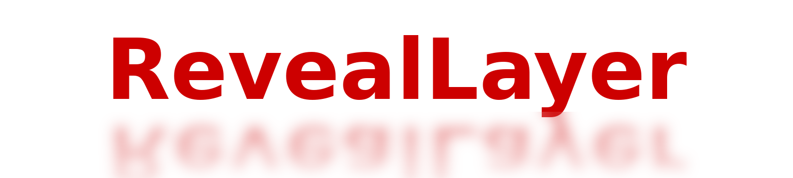
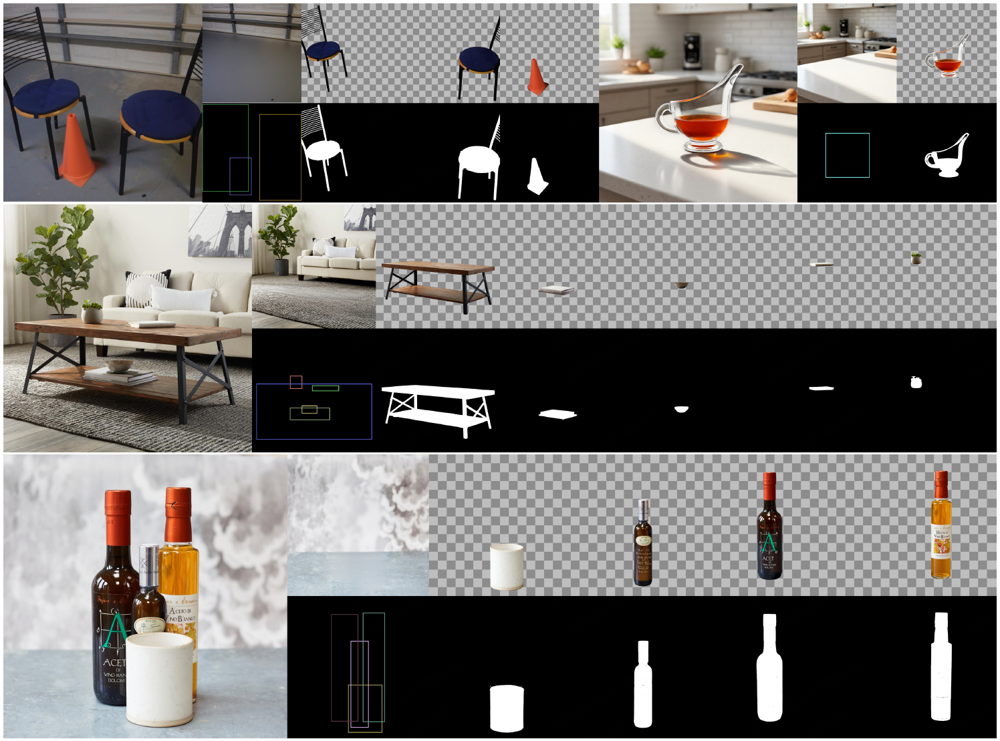
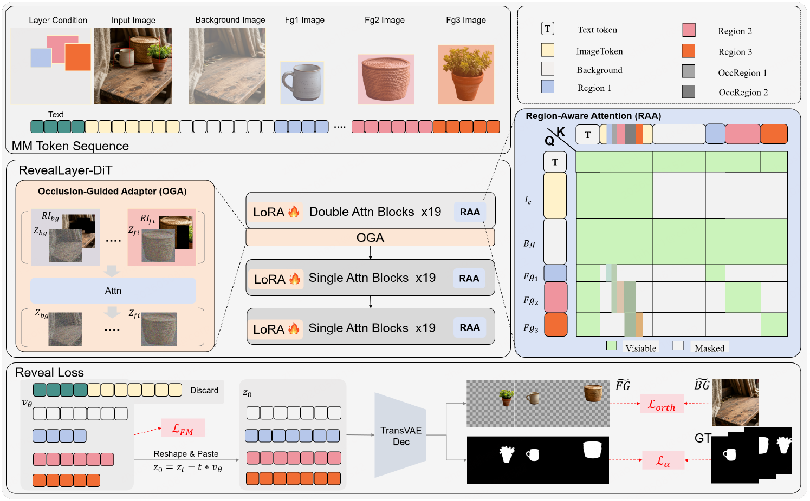
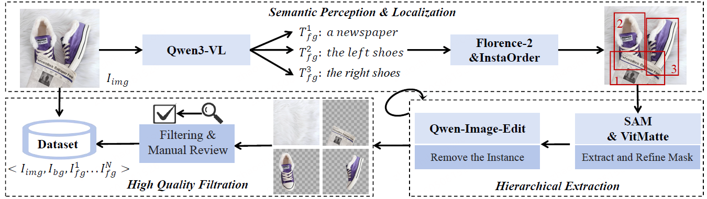

<div align="center">

<div style="text-align: center;">
    
    <h2>Disentangling Hidden and Visible Layers via Occlusion-Aware Image Decomposition</h2>
</div>

<div>
  <strong>
  Binhao Wang<sup>1,2,*</sup>,&nbsp;
  Shihao Zhao<sup>1,2,*</sup>,&nbsp;
  Bo Cheng<sup>2,*,†</sup>,&nbsp;
  Qiuyu Ji<sup>1,2</sup>,&nbsp;
  Yuhang Ma<sup>2</sup>,<br>
  Liebucha Wu<sup>2</sup>,&nbsp;
  Shanyuan Liu<sup>2</sup>,&nbsp;
  Dawei Leng<sup>2,‡</sup>,&nbsp;
  Yuhui Yin<sup>2</sup>
  </strong>
</div>

<div>
  <sup>1</sup>Wenzhou University&nbsp;&nbsp;&nbsp;
  <sup>2</sup>360 AI Research
</div>

<div>
  <sup>*</sup> Equal Contribution. &nbsp;
  <sup>†</sup> Project Lead. &nbsp;
  <sup>‡</sup> Corresponding Author.
</div>

<br>

<div>
  <h3>🔥 Accepted by ICML 2026!</h3>
</div>

<div>
  <a href="https://zhao0100.github.io/RevealLayer/" target="_blank">
    
  </a>
  &ensp;
  <a href="https://arxiv.org/abs/2605.11818" target="_blank">
    
  </a>
  &ensp;
  <a href="https://huggingface.co/datasets/qihoo360/RevealLayer-100K" target="_blank">
    
  </a>
  &ensp;
  <a href="https://huggingface.co/qihoo360/RevealLayer" target="_blank">
    
  </a>
  &ensp;
  <a href="https://research.360.cn/products/Reveal-Layer" target="_blank">
    
  </a>
</div>

<br>

<strong>
RevealLayer decomposes an RGB image into multiple RGBA layers, enabling precise layer separation and reliable recovery of occluded content in natural scenes.
</strong>

<br><br>

<div style="width: 100%; text-align: center; margin: auto;">
    
</div>

For more visual results, go checkout our <a href="https://360cvgroup.github.io/RevealLayer/" target="_blank">project page</a>.

---

</div>

## ⭐ Update

- **[2026.05]** We released the RevealLayer checkpoint on [Hugging Face](https://huggingface.co/qihoo360/RevealLayer).
- **[2026.05]** We released the RevealLayer paper and inference code.

### ✅ TODO

- [ ] Release RevealLayer-100K and RevealLayerBench.
- [ ] Release an improved version of RevealLayer with stronger layer consistency and higher inference efficiency.

---

## 🎃 Overview

RevealLayer focuses on occlusion-aware image layer decomposition, recovering visible and hidden RGBA layers from a single RGB image with region guidance.

<div style="width: 100%; text-align: center; margin: auto;">
    
</div>

---

## 📷 Datasets

<div style="width: 100%; text-align: center; margin: auto;">
    
</div>

We construct a large-scale multi-layer image decomposition dataset, including **RevealLayer-100K** for training and **RevealLayerBench** for evaluation. RevealLayer-100K contains 100K multi-layer natural image tuples with RGB images, background layers, RGBA foreground layers, and bounding boxes. RevealLayerBench contains 200 high-quality manually curated images, covering challenging cases such as complex occlusions, large-area objects, transparent materials, small foreground objects, and multi-layer scenes.

🔥 We will release **RevealLayer-100K** and **RevealLayerBench** on [Hugging Face](https://huggingface.co/datasets/qihoo360/RevealLayer-100K). We hope they can serve as useful training and evaluation resources for future research on occlusion-aware image layer decomposition.

> 🚩 The datasets are intended for research use. Please follow the license and terms provided with the released dataset.

---

## 🔧 Quick Start

### 0. Experimental environment

We tested our inference code with Python 3.10 and CUDA GPUs.

### 1. Setup repository and environment

```bash
git clone https://github.com/Zhao0100/RevealLayer.git
cd RevealLayer

conda create -n reveallayer python=3.10
conda activate reveallayer

pip install -r requirements.txt

pip install flash-attn --no-build-isolation

cd diffusers
pip install .
cd ..
```

---

## 📦 Prepare the models

Model files are hosted with Git LFS, so please enable Git LFS before cloning model repositories.

```bash
git lfs install
```

Download the RevealLayer checkpoint:

```bash
git clone https://huggingface.co/qihoo360/RevealLayer models/RevealLayer
```

Download FLUX.1-dev:

```bash
git clone https://huggingface.co/black-forest-labs/FLUX.1-dev models/FLUX.1-dev
```

The expected model directory structure is:

```text
models
├── RevealLayer
│   ├── pytorch_lora_weights.safetensors
│   ├── layer_pe.pt
│   ├── Refiner.pt
│   ├── xvae
│   │   └── transparent_decoder_ckpt.pth
│   └── ...
├── FLUX.1-dev
│   ├── transformer
│   ├── vae
│   ├── text_encoder
│   ├── text_encoder_2
│   ├── tokenizer
│   ├── tokenizer_2
│   └── ...
```

If your local model directory is different, please modify the corresponding paths in the inference script.

---

## 🗂️ Prepare input JSON

The input JSON should contain a list of samples. Each sample should include the input image path and detected bounding boxes.

Example:

```json
[
  {
    "imgid": "examples",
    "full_image": "RevealLayer-Bench/examples/full_image.png",
    "background": "RevealLayer-Bench/examples/background.png",
    "LayerInfoRaw": [
      "RevealLayer-Bench/examples/layer_0.png",
      "RevealLayer-Bench/examples/layer_1.png"
    ],
    "detections": [
      {
        "bbox": [x1, y1, x2, y2]
      },
      {
        "bbox": [x1, y1, x2, y2]
      }
    ]
  }
]
```

The expected fields are:

```text
imgid        : sample id
full_image   : path to the input RGB image
background   : path to the background image, optional for inference
LayerInfoRaw : paths to the ground-truth RGBA layers, optional for inference
detections   : detected foreground objects
bbox         : bounding box in [x1, y1, x2, y2] format
```

---

## ⚡ Inference

Run inference with:

```bash
bash infer.sh 0
```
> **Note:** `--guidance_scale` controls the decomposition strength. In our experiments, we use `--guidance_scale 1.0`, which provides the best background removal performance while preserving background details.

Before running, please make sure the paths in `infer.sh` and `infer.py` match your local model and data directories.

---

## 📑 Citation

If you find our work useful for your research, please consider citing:

```bibtex
@inproceedings{wang2026reveallayer,
  title={RevealLayer: Disentangling Hidden and Visible Layers via Occlusion-Aware Image Decomposition},
  author={Wang, Binhao and Zhao, Shihao and Cheng, Bo and Ji, Qiuyu and Ma, Yuhang and Wu, Liebucha and Liu, Shanyuan and Leng, Dawei and Yin, Yuhui},
  booktitle={International Conference on Machine Learning},
  year={2026}
}
```

---

## 📝 License

This project is licensed under the [Apache License 2.0](LICENSE).
